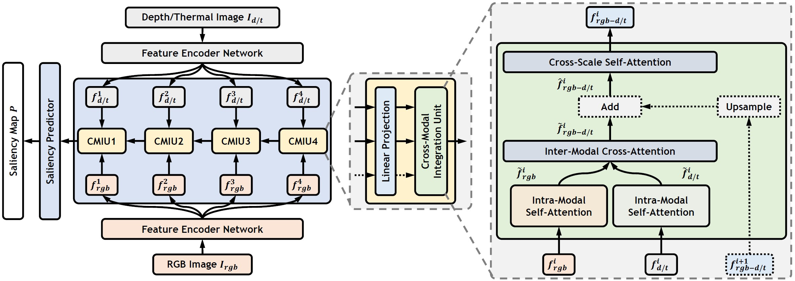
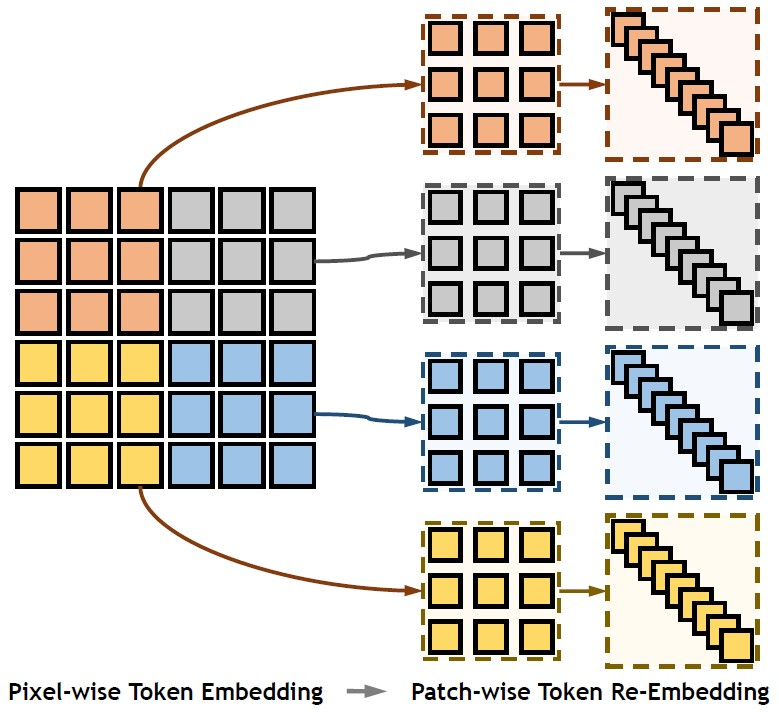
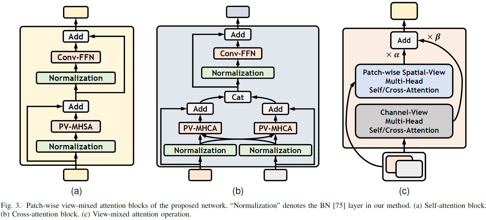
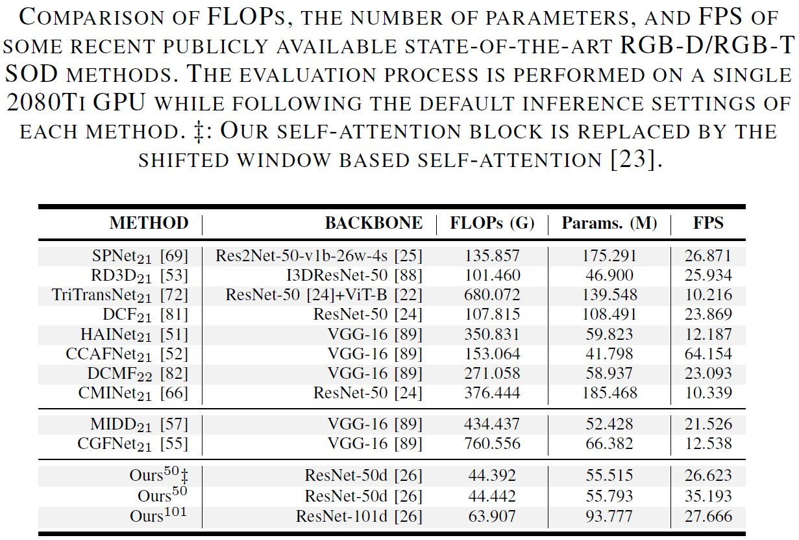
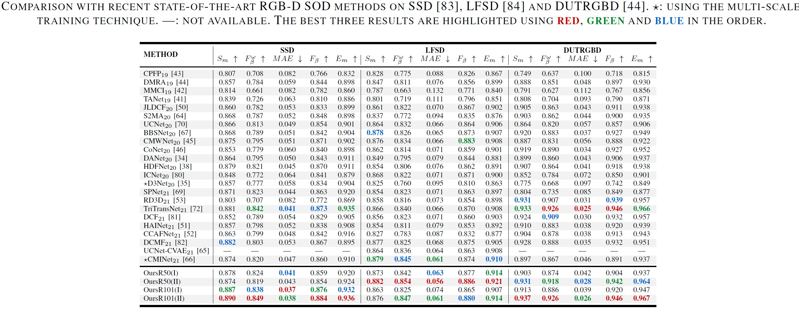
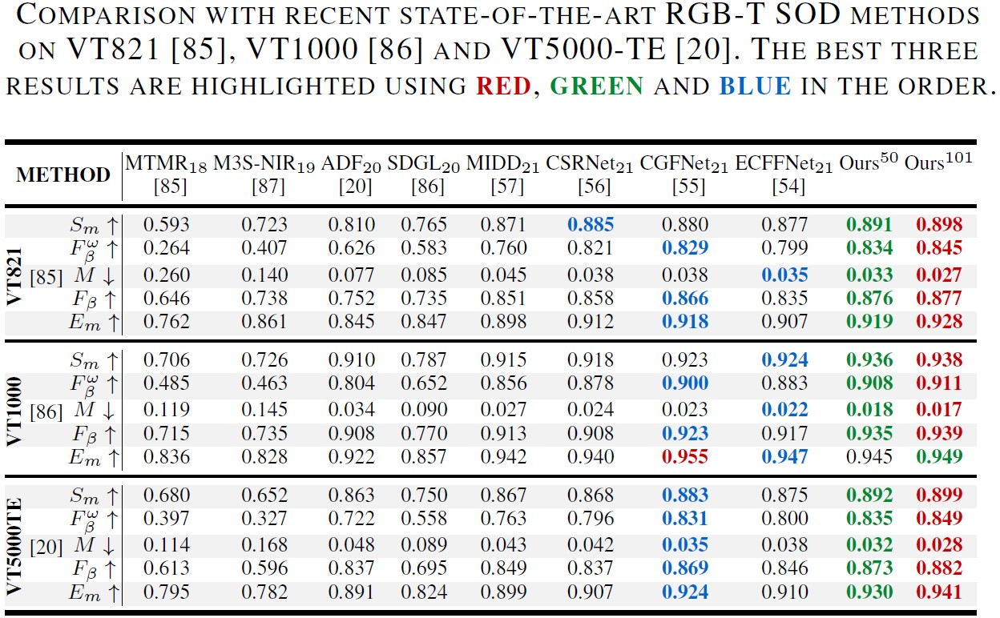

# (TIP 2023) CAVER: Cross-Modal View-Mixed Transformer for Bi-Modal Salient Object Detection

[](https://opensource.org/licenses/MIT)


[](https://arxiv.org/abs/2112.02363)
[](https://ieeexplore.ieee.org/document/10015667)
[](https://lartpang.github.io/docs/caver.html)

```
@article{CAVER-TIP2023,
  author={Pang, Youwei and Zhao, Xiaoqi and Zhang, Lihe and Lu, Huchuan},
  journal={IEEE Transactions on Image Processing},
  title={CAVER: Cross-Modal View-Mixed Transformer for Bi-Modal Salient Object Detection},
  year={2023},
  volume={},
  number={},
  pages={1-1},
  doi={10.1109/TIP.2023.3234702}
}
```

## Download

- Predictions: https://github.com/lartpang/CAVER/releases/tag/rgbd-rgbt-results
- Pre-trained parameters: https://github.com/lartpang/CAVER/releases/tag/rgbd-rgbt-models

## Code

Code will come soon!

## Method Detials



*The overview of the proposed model. This is a dual-stream encoder-decoder architecture with a very simple and straightforward form. Note that the dashed line denotes an optional path for the decoder. In our model, the CMIU4 only contains two inputs $f^{4}_{rgb}$ and $f^{4}_{d/t}$ and $\hat{f}^{4}_{rgb-d/t}=\tilde{f}^{4}_{rgb-d/t}$. The feature $f^{i+1}_{rgb-d/t}$ exists in CMIU1-3, which is upsampled using bilinear interpolation in the 2D form.*



*Patch-wise token re-embedding (PTRE). Before matrix multiplication, the parameter-free PTRE is used to reshape features. Thus, pixel-wise tokens are aggregated and converted into patch-wise tokens.*



## Comparison with SOTA

PySODEvalToolkit: A Python-based Evaluation Toolbox for Salient Object Detection and Camouflaged Object Detection: <https://github.com/lartpang/PySODEvalToolkit>









