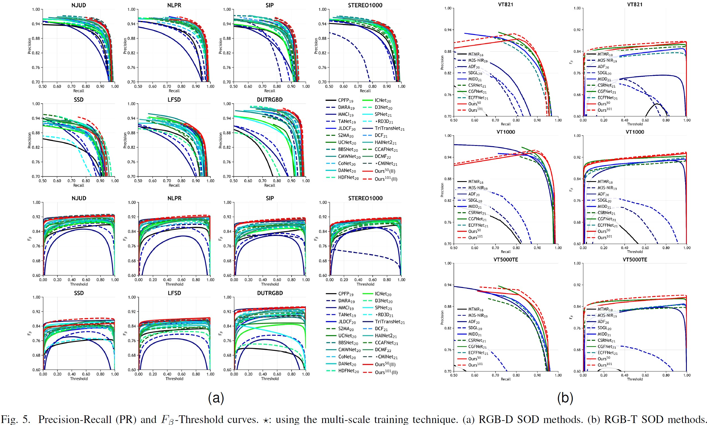

# (TIP 2023) CAVER: Cross-Modal View-Mixed Transformer for Bi-Modal Salient Object Detection

[](https://opensource.org/licenses/MIT)


[](https://arxiv.org/abs/2112.02363)
[](https://ieeexplore.ieee.org/document/10015667)
[](https://lartpang.github.io/docs/caver.html)

<div align="center">

</div>

```
@article{CAVER-TIP2023,
  author={Pang, Youwei and Zhao, Xiaoqi and Zhang, Lihe and Lu, Huchuan},
  journal={IEEE Transactions on Image Processing},
  title={CAVER: Cross-Modal View-Mixed Transformer for Bi-Modal Salient Object Detection},
  year={2023},
  volume={},
  number={},
  pages={1-1},
  doi={10.1109/TIP.2023.3234702}
}
```

## Download

- Predictions: https://github.com/lartpang/CAVER/releases/tag/rgbd-rgbt-results
- Pre-trained parameters: https://github.com/lartpang/CAVER/releases/tag/rgbd-rgbt-models

## Usage

### Prepare

0. Create directories for the experiment and parameter files: `mkdir output pretrained`.
1. Download the backbone parameters pretrained on ImageNet-1K from <https://github.com/lartpang/CAVER/releases/tag/backbone-parameters>.
2. Please use `conda` to install `torch` (1.12.1) and `torchvision` (0.13.1).
3. Install other packages: `pip install -r requirements.txt`. 
4. Set your path of all datasets in `datasets.py`.

### Train & Evaluate

```shell
# CAVER_R50D
python main.py --config ./configs/rgbd-2dataset.py --model-name CAVER_R50D --info rgbd-2dataset --pretrained ./pretrained/resnet50d.pth
python main.py --config ./configs/rgbd-3dataset.py --model-name CAVER_R50D --info rgbd-3dataset --pretrained ./pretrained/resnet50d.pth
python main.py --config ./configs/rgbt.py --model-name CAVER_R50D --info rgbt --pretrained ./pretrained/resnet50d.pth

# CAVER_R101D
python main.py --config ./configs/rgbd-2dataset.py --model-name CAVER_R101D --info rgbd-2dataset --pretrained ./pretrained/resnet101d.pth
python main.py --config ./configs/rgbd-3dataset.py --model-name CAVER_R101D --info rgbd-3dataset --pretrained ./pretrained/resnet101d.pth
python main.py --config ./configs/rgbt.py --model-name CAVER_R101D --info rgbt --pretrained ./pretrained/resnet101d.pth
```

When the training process is over, the script will evaluate the model on those datasets listed in your config file and the results will be printed in the terminal and saved into the csv file in the project directory. 
If you want to directly evaluate the model, please execute the following commands.
The key settings are `--evaluate` and `--load-from`, which specify the evaluation mode and the weight to be loaded, respectively.
Here `--show-bar` is used to set whether to display a progress bar.

```shell
# CAVER_R50D
python main.py --config ./configs/rgbd-2dataset.py --model-name CAVER_R50D --info rgbd-2dataset --load-from ./output/caver-r50d-rgbd-njudnlpr.pt --evaluate --show-bar
python main.py --config ./configs/rgbd-3dataset.py --model-name CAVER_R50D --info rgbd-3dataset --load-from ./output/caver-r50d-rgbd-njudnlprdutrgbd.pt --evaluate --show-bar
python main.py --config ./configs/rgbt.py --model-name CAVER_R50D --info rgbt --load-from ./output/caver-r50d-rgbt.pt --evaluate --show-bar

# CAVER_R101D
python main.py --config ./configs/rgbd-2dataset.py --model-name CAVER_R101D --info rgbd-2dataset --load-from ./output/caver-r101d-rgbd-njudnlpr.pt --evaluate --show-bar
python main.py --config ./configs/rgbd-3dataset.py --model-name CAVER_R101D --info rgbd-3dataset --load-from ./output/caver-r101d-rgbd-njudnlprdutrgbd.pt --evaluate --show-bar
python main.py --config ./configs/rgbt.py --model-name CAVER_R101D --info rgbt --load-from ./output/caver-r101d-rgbt.pt --evaluate --show-bar
```

## Method Detials


*The overview of the proposed model. This is a dual-stream encoder-decoder architecture with a very simple and straightforward form. Note that the dashed line denotes an optional path for the decoder. In our model, the CMIU4 only contains two inputs $f^{4}_{rgb}$ and $f^{4}_{d/t}$ and $\hat{f}^{4}_{rgb-d/t}=\tilde{f}^{4}_{rgb-d/t}$. The feature $f^{i+1}_{rgb-d/t}$ exists in CMIU1-3, which is upsampled using bilinear interpolation in the 2D form.*

<div align="center">

</div>

*Patch-wise token re-embedding (PTRE). Before matrix multiplication, the parameter-free PTRE is used to reshape features. Thus, pixel-wise tokens are aggregated and converted into patch-wise tokens.*


## Comparison with SOTA

PySODEvalToolkit: A Python-based Evaluation Toolbox for Salient Object Detection and Camouflaged Object Detection: <https://github.com/lartpang/PySODEvalToolkit>

<div align="center">

</div>


<div align="center">

</div>


